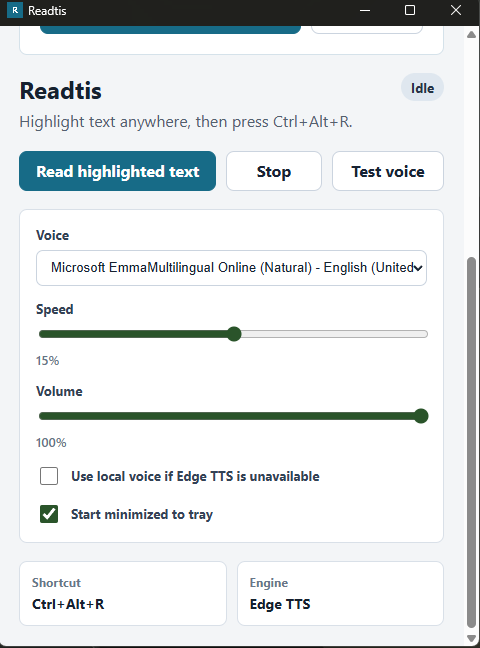

# Readtis

Readtis is a small Windows tray app that reads highlighted text aloud with natural Edge TTS voices.

It is built for the ordinary moment where a chat reply, email, document, or long response is worth hearing instead of staring at. Highlight the text, press `Ctrl+Alt+R`, and let Readtis read it once from beginning to end.


## Features

- **Read highlighted text anywhere** using the current selection and a reliable clipboard-copy capture path.
- **Natural neural voices** through Edge TTS, with local Microsoft TTS available only as an optional fallback.
- **Tray-first workflow** with quick actions for Open Panel, Read Highlighted Text, Stop, Test Voice, and Quit.
- **Compact desktop UI** for voice, speed, volume, startup, and fallback settings.
- **On-screen reading indicator** that appears while audio is preparing or playing.
- **First-run welcome screen** that explains the shortcut and lets new users test the voice.
- **Global shortcut support** with a keyboard watcher fallback if another app already owns the hotkey.
- **GitHub Actions build** that produces a downloadable Windows artifact and release zip.

## Quick Start

### Run From Source

```powershell
git clone <your-repo-url>
cd Read_this
python -m pip install edge-tts -t python_deps
cargo run --manifest-path .\src-tauri\Cargo.toml
```

The app starts in the system tray after onboarding. Open the tray menu, choose **Open Panel**, then test the voice.

### Use The Shortcut

1. Highlight text in any app.
2. Press `Ctrl+Alt+R`.
3. Readtis shows a small reading indicator, fetches Edge TTS audio, and plays it once.
4. Use **Stop** from the tray, panel, or indicator if you need to interrupt long text.

## Downloading CI Builds

This repo includes a GitHub Actions workflow that builds the Windows executable on every push, pull request, and manual run.

To download a build from GitHub:

1. Open the repository on GitHub.
2. Go to **Actions**.
3. Open the latest successful **Windows Build** run.
4. Download the `readtis-windows-x64` artifact.
5. Extract the artifact and run `readtis.exe`.

The artifact includes `python_deps` because the current Edge TTS path uses the maintained Python `edge-tts` client at runtime.

Tagged builds are also published to GitHub Releases. Create and push a version tag to publish a release:

```powershell
git tag v0.1.0
git push origin v0.1.0
```

## Privacy And Local Data

Readtis is designed as a local tray utility and does not intentionally keep a reading history.

What Readtis stores on your PC:

- App settings, including selected voice, speed, volume, startup preference, local fallback preference, and onboarding status.
- The bundled or installed `python_deps` runtime folder used by the Edge TTS client.

What Readtis handles temporarily:

- Highlighted text is copied through the clipboard so the app can read the current selection.
- Text clipboard content is restored after capture, but rich clipboard formats are not fully preserved yet.
- Edge TTS audio is generated as a temporary MP3 file and deleted after playback.

Readtis does not intentionally save highlighted text, generated speech audio, or reading history. If the app or operating system crashes during a read, temporary OS files may remain until cleaned by Windows or deleted manually.

## Adding Screenshots And Video

Keep README media in `docs/assets/` so links stay stable on GitHub.

### Screenshot

Save your screenshot as:

```text
docs/assets/readtis-panel.png
```

Then add it to the README:

```markdown

```

### Animated Demo

For an inline demo, export the screen recording as a GIF:

```text
docs/assets/readtis-demo.gif
```

Then embed it:

```markdown

```

### Video Demo

GitHub README pages are most reliable when videos are linked from a thumbnail instead of embedded directly.

Save a thumbnail:

```text
docs/assets/readtis-video-cover.png
```

Save or upload the video as:

```text
docs/assets/readtis-demo.mp4
```

Then add:

```markdown
[](docs/assets/readtis-demo.mp4)
```

For a more polished public repo, upload the video to a GitHub Release, YouTube, or Loom, then link the thumbnail to that URL.

## Build Locally

### Requirements

- Windows 10 or newer
- Rust stable toolchain
- Python 3.10 or newer
- Microsoft Edge WebView2 runtime

### Commands

```powershell
python -m pip install edge-tts -t python_deps
cargo check --manifest-path .\src-tauri\Cargo.toml
cargo build --release --manifest-path .\src-tauri\Cargo.toml
```

The release executable is created at:

```text
src-tauri\target\release\readtis.exe
```

## Architecture

Readtis is split into a lightweight frontend and a Rust desktop backend.

```text
app/                  Plain HTML, CSS, and JavaScript control panel
docs/assets/          README images, logo, screenshots, and demo media
src-tauri/            Tauri v2 + Rust desktop application
vendor/msedge-tts/    Local patched Rust Edge TTS crate retained as fallback research
python_deps/          Local runtime folder for the working edge-tts client
ReadThis.ps1          Original PowerShell prototype
```

The normal read flow is:

```text
Hotkey or tray action
-> capture highlighted text
-> request Edge TTS audio
-> play MP3 audio locally
-> stop naturally at the end
```

## Notes On Latency

Edge TTS is network-backed. Short text usually starts quickly, but longer selections can take a moment because the app has to request and receive synthesized audio before playback begins.

## Troubleshooting

### Nothing happens when I press `Ctrl+Alt+R`

Another app may already own the global shortcut. Readtis has a polling fallback, so restart the app and try again. You can also use **Read Highlighted Text** from the tray menu.

### Edge TTS fails

Make sure the artifact includes `python_deps`, or reinstall the runtime dependency:

```powershell
python -m pip install edge-tts -t python_deps
```

If your network blocks Microsoft's speech endpoint, enable the local fallback in the app settings.

### The clipboard changes briefly

Readtis captures selected text by temporarily sending `Ctrl+C`, reading the copied text, and restoring text clipboard content. Rich clipboard formats are a future improvement.

## GitHub Actions

The workflow lives at `.github/workflows/windows-build.yml`.

It performs these steps:

- Checks out the repository.
- Installs Python and the `edge-tts` runtime dependency.
- Installs Rust stable.
- Runs `cargo check`.
- Builds `readtis.exe` in release mode.
- Stages the executable with `python_deps`.
- Uploads a downloadable Windows artifact.
- Publishes a GitHub Release when the workflow runs from a tag like `v0.1.0`.

## Publisher And Signing

The app metadata uses `Motionphrey` as the publisher. Windows may still show unknown publisher warnings until the executable or installer is signed with a trusted code-signing certificate.

## Legacy Prototype

The original tray prototype is still available:

```powershell
powershell.exe -NoProfile -ExecutionPolicy Bypass -STA -File .\ReadThis.ps1
```

## Research References

- GitHub recommends README files clearly explain what the project does, why it is useful, how to get started, where to get help, and who maintains it.
- GitHub Actions artifacts are the standard way to publish build outputs from workflow runs.
- Tauri's Windows distribution guidance recommends building Windows installers and executables on Windows runners.
